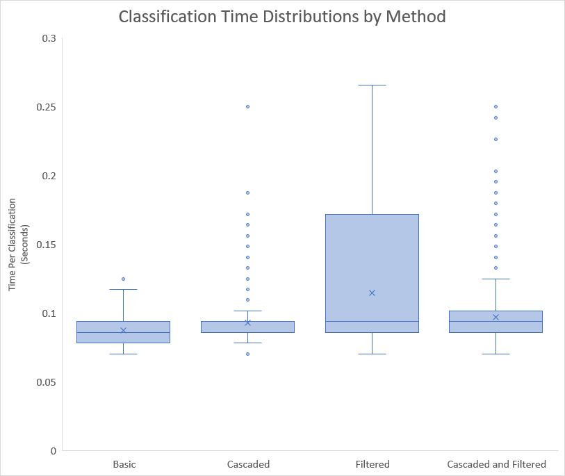

# VBA_Cascading-Text-Classifier
This is a custom ML algorithm I developed and implemented in VBA to classify text data.

  * [1.0 Introduction](#10-introduction)
    + [1.1 Original Project](#11-original-project)
    + [1.2 Problem Description](#12-problem-description)
  * [2.0 Detailed Explanation](#20-detailed-explanation)
    + [2.1 Classifier Algorithm](#21-classifier-algorithm)
      - [2.1.1 GuessValue](#211-guessvalue)
      - [2.1.2 CascadeGuessValue](#212-cascadeguessvalue)
      - [2.1.3 Notes on Model Persistence and Scaling](#213-notes-on-model-persistence-and-scaling)
    + [2.2 Dataset Filtering/Boolean Masking](#22-dataset-filtering-boolean-masking)
    + [2.3 Tolerance and Tuning](#23-tolerance-and-tuning)
  * [3.0 Implementation Examples](#30-implementation-examples)
    + [3.1 Transaction Categorization](#31-transaction-categorization)
    + [3.2 Transaction Filename - Account Matching](#32-transaction-filename---account-matching)
  * [4.0 Classification Performance](#40-classification-performance)
    + [4.1 Methodology](#41-methodology)
    + [4.2 Results and Discussion](#42-results-and-discussion)
      - [4.2.1 Classification Accuracy](#421-classification-accuracy)
      - [4.2.2 Classification Time](#422-classification-time)
      - [4.2.3 Effect of Varying Discrimination Threshold](#423-effect-of-varying-discrimination-threshold)
  * [5.0 Dependencies](#50-dependencies)

## 1.0 Introduction
### 1.1 Original Project
Along with working with data, one of my passions is personal finance, so since 2016 I have tracked and classified every single transaction I've made (groceries, rent, restaurants, cash withdrawals, transfer to/from specific accounts, etc.).
This allows me to see how my money flows and grows, how my spending compares to budget, and gives me great data for future financial planning.

First I built an Excel based Finance dashboard with an underlying database and data model.
Next I developed a flexible VBA based ETL process to load downloaded data from various banking institutions into my 'database'.
And finally, I developed this machine learning algorithm and codebase to automatically classify transactions as a final step to the loading process.

Why VBA? ... well, it was my strongest programming language at the time, I already had a robust framework developed in Excel for the data, and I thought it would be fun to build an ML algorithm from scratch.

Here is a sample of one dashboard screen with dollar values removed for privacy.

### 1.2 Problem Description
My goals were to:
1. Correctly classify transactions based on previous historical transaction descriptions

2. Not guess a classification if certainty is too low

3. Be able to classify completely new transaction descriptions based on similarly named transactions
    - I.e. if I had already been to `Bob's No Frills Hamilton` and classified it as `Groceries`, it should be able to tell that `Dave's No Frills Burlington` is also `Groceries` despite never having been there before.

4. Be able to classify identical transaction descriptions differently depending on the source account of the data
    - At some banks if you transfer money between your chequing/savings, the transaction descriptions may only say `Transfer In` / `Transfer Out`.  Therefore if the transaction occurs from your chequing account, the algorithm should know those transactions could only come from your savings account (since you can’t transfer money from one account to the exact same account).
   
5. Classify a monthly batch of transactions per account (typically 5-25) in <5  seconds (this is fast enough for my personal use)

6. Generalize the code enough that the algorithm could be used for different applications

## 2.0 Detailed Explanation
### 2.1 Classifier Algorithm
**Classification Call Stack:**

`GuessValue`<-`CascadeGuessValue`<-*Custom_Implementation_function*

#### 2.1.1 GuessValue
At the lowest level (`GuessValue`), the algorithm simply calculates the probability that a string belongs to each class and then picks the highest. [**This satisfied requirement #1.**](#12-problem-description)

![P(class)=\frac{\sum[{class\. matches}]}{\sum[{matches}]}](https://latex.codecogs.com/gif.latex?\bg_white&space;P(class)=\frac{\sum[{class\.&space;matches}]}{\sum[{matches}]})

#### 2.1.2 CascadeGuessValue
At the next level up (`CascadeGuessValue`), the algorithm takes the input string and runs `GuessValue`, then evaluates the result.  If the probability from `GuessValue` is at or above a certain tolerance and a minimum number of matches has been found, then the prediction is accepted. [**This satisfied requirement #2.**](#12-problem-description)

Otherwise the prediction is thrown away and the input string is "cascaded" into more substrings.
Cascading creates substrings by splitting the input string using space (" ") as a delimiter into pieces, and then joining these pieces together (preserving string order) to create the desired number of substrings.
    
    E.g.
        CascadeString("Hello world foo bar")
        Substrings = 1 -> "Hello world foo bar"

        Substrings = 2 -> "Hello world foo",
                          "world foo bar"

        Substrings = 3 -> "Hello world",
                          "world foo",
                          "foo bar"

        Substrings = 4 -> "Hello",
                          "world",
                          "foo",
                          "bar"

`GuessValue` is then run on the new set of substrings, and again returns a result if found acceptable, otherwise it will cascade the input string to the next level. [**Cascading was implemented to satisfy requirement #3.**](#12-problem-description)

Note, `CascadeGuessValue` could be modified to use a different evaluation function than `GuessValue`.

#### 2.1.3 Notes on Model Persistence and Scaling
This code doesn't create a persistent model.
It "retrains" each time it is implemented.  This is efficient enough for my purposes and scale.

However if this needed to be drastically scaled up, the model could be made persistent by storing a 2D "result" array of probability scores for each string and substring on one axis, and each class on the other axis. This would be the model fitting/training procedure.

To implement further dimensionality (changing the probability score based on a feature other than the input string, e.g. for my use case, considering the account where a transaction occurred), more dimensions could be added the "result" array.

Then predicting with the trained model would just be a matter of looking up from the "result" array: the class with the highest probability score for the given substring and other given dimensions.

### 2.2 Dataset Filtering/Boolean Masking
Providing a filtered training data set can simulate adding more features to model training.

A boolean masking framework was developed to implement this.

**Data Filter Call Stack:**

*Custom_Filter_function*<-`GenerateFilter`<-*Custom_Implementation_function*

The `GenerateFilter` function will generate a boolean mask that can be passed to `CascadeGuessValue` to tell it to skip over rows of data when doing an evaluation. [**This was implemented to satisfy requirement #4.**](#12-problem-description)

Since VBA's array functionality is limited, I also create the `LogicArray` function to allow for logical operations (AND, OR, NOT) on boolean masks.

### 2.3 Tolerance and Tuning
Like other classification algorithms, this algorithm computes a probability/certainty for its prediction. The tolerance (a.k.a. *discrimination threshold*) can be tuned to achieve a user's preference (e.g. high precision, high recall).

## 3.0 Implementation Examples
For instructions on how to use this code see [README_HOWTOUSE.md](README_HOWTOUSE.md).

### 3.1 Transaction Categorization
The [`GuessCategory`](src/mdlGuess.bas) function shows how I implemented the cascading text classifier along with the boolean masking functionality to classify my transaction data. I was able to satisfy requirement 4 by first filtering the training data set to only include transactions from the same account.  If no classification was found on this first pass, then the filter is removed to increase the likelihood of matches being found.

### 3.2 Transaction Filename - Account Matching
The [`GuessAccount`](src/mdlGuess.bas) function is a different implementation of the classifier code that I used to slightly streamline my ETL process.  The ETL process is to:
1. Download account transactions to `.csv`s
2. Click the `import data` button in my Dashboard file
3. From a userform, select the file to import
4. From a userform, select the bank account to which the transactions belong
5. Code transforms data to fit into transaction table, and auto-classifies transactions

`GuessAccount` is used to determine which account is likely being imported based on the `.csv` file name, and pre-highlight that account option in the userform for step 4 of the ETL.  It is a very small quality of life improvement, and [**demonstrates that the code satisfied requirement #6.**](#12-problem-description)

## 4.0 Classification Performance
    In summary the classifier demonstrated an 84% categorization accuracy with an average guess evaluation time of 0.097 seconds.

### 4.1 Methodology

For this evaluation I used my own financial transaction data (n = 4143) and split it, 70/30, into a training set (ntrain = 2091) and test set (ntest = 1242). There are 92 distinct categories a transaction could be classified as.

As described in [section 3.1](#31-Transaction-Categorization), I used a combination of cascading substrings and filtering the data set on the first pass.  However all data presented below will show 4 methods for comparison:

1. **Basic**
    - One pass classification that looks for exact string matches in the training set.
2. **Cascaded**
    - Multipass classification that cuts the input string into smaller substrings to match with the training set until a suitable guess is found.
3. **Filtered**
    - Two pass classification. First the training set is filtered so only transactions from the same account are considered. If no acceptable categorization found then retry with full training set.
4. **Cascaded and Filtered**
    - Combination of cascading substrings and first pass filtering.
    - This is the fully implemented classifier.

For methods 2-4 a discrimination threshold of 0.4 was used to determine whether a suitable guess had been found.  The exact same training/test sets were used for each method.

### 4.2 Results and Discussion

#### 4.2.1 Classification Accuracy
The chart below shows how the accuracy varied depending on the method used.

The solid green bar represents the proportion of correct classifications, the pink hashed bar represents the proportion of incorrect classifications, and the white bar represents the proportion of data points where no classification was determined (no matches found).

Observations:
- Filtering alone improves the accuracy of classifications compared to the basic method; however it doesn't introduce any new potential matches so the percent unclassified remains unchanged
    - 75% of all transactions classified in both cases
    - Of that 75%, filtering improved accuracy from 84% to 92%
- On the other hand, cascading alone allows for classification of transactions that would otherwise be unguessed using the basic method; however the overall accuracy of classifications was actually lower than basic
    - 75% to 99% of all transactions classified
    - Cascading accuracy was 77% vs basic at 84%
- Combining the cascading and filtering methods allows for classification of nearly all transactions while still maintaining an 84% accuracy

#### 4.2.2 Classification Time
The box-and-whisker chart below shows the distribution of guess times by method.

The average times for all methods were around 0.1 second/classification.  This is fairly slow but remember that the model is non-persistent and being retrained with each classification. More about this discussion in [section 2.1.3](#213-notes-on-model-persistence-and-scaling)

Observations:
- The basic method is the fastest, but not by a significant amount
- The classification times of the filtering method had a much higher 3rd and 4th quartile than the other methods
    - This is likely due to the increased overhead time to generate the filter, and then retraining the model if no match is found on the filtered dataset.
- The cascaded method timing is surprisingly similar to the basic method but can occasionally take twice as long
    - These cases are probably where no match could be found until the transaction string had been divided into individual words
- Combining the cascade and filtering methods is more computationally efficient than filtering alone
    - For the full method (cascaded and filtered) the average guess evaluation time of *0.097 seconds*
    - This means it can classify ~51 transactions within 5 seconds which [**satisfies requirement #5**](#12-problem-description)

#### 4.2.3 Effect of Varying Discrimination Threshold
The charts below shows how the classification results would change for each people by varying the tolerance or discrimination threshold (x-axis). The higher the tolerance the more classifications would not be accepted, increasing the proportion of uncategorized transactions.

The hashed green and pink sectors represent the proportion of correct and incorrect classifications respectively that would remain uncategorized at any given tolerance.

For my financial tracking application I found the sweet spot to be at 40% tolerance where some incorrect classifications are filtered out, but the majority of correct classifications remain.

## 5.0 Dependencies
https://github.com/dnissim/VBA_General

A general library of functions for interacting with different data objects in Excel, and effectively working with array data in memory.